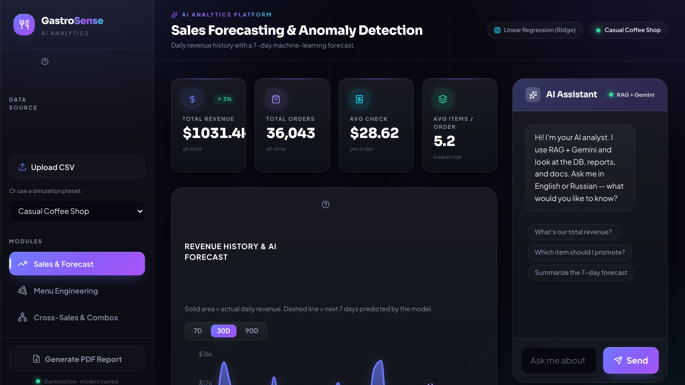
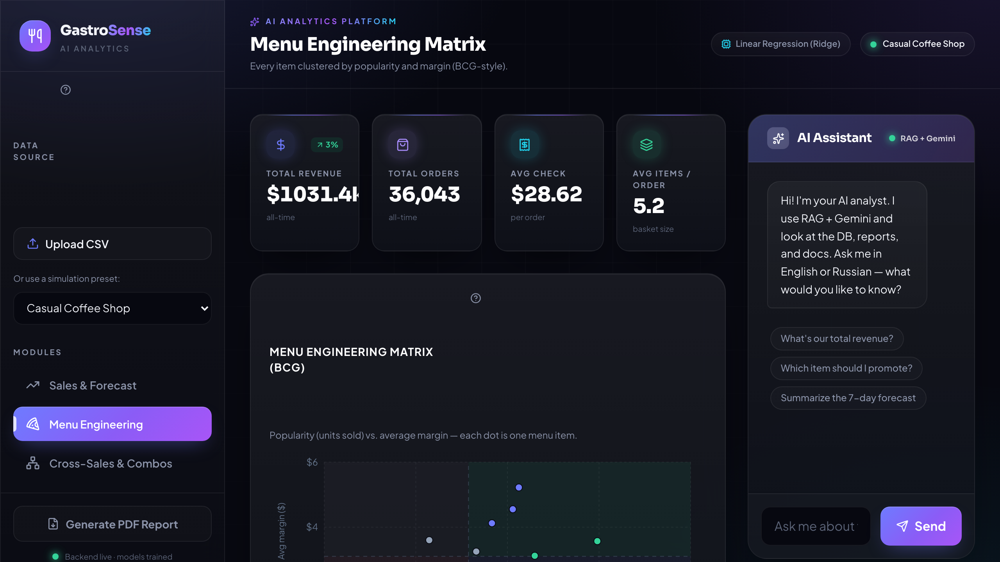
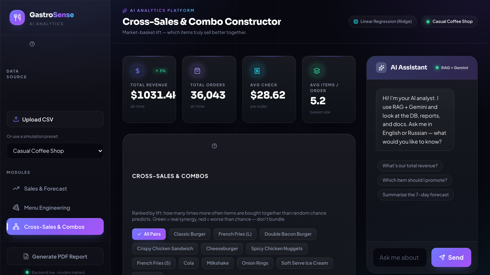

# GastroSense


<p align="center">
  <b><a href="https://gastrosense-frontend.onrender.com">🚀 Live demo</a></b> &nbsp;·&nbsp;
  <a href="https://gastrosense-backend.onrender.com/docs">API docs</a> &nbsp;·&nbsp;
  <a href="#русская-версия">Русская версия</a>
</p>



**[Russian version (separate file) / Русская версия (отдельный файл)](README.ru.md)** — or just scroll down, it's [also down there](#русская-версия).

A restaurant analytics dashboard I built to practice end-to-end ML engineering: not just training models, but shipping them behind a real API, a real frontend, and a chat assistant that can explain the results in plain language.

It takes raw order data (CSV exports from POS systems like iiko or R-Keeper, or generated demo data) and turns it into three things a restaurant owner actually cares about: a demand forecast, a menu profitability breakdown, and a combo/cross-sell analysis grounded in real order history instead of guesswork.

**Highlights**

- 🔮 **Auto-selected forecaster** — Ridge / Random Forest / XGBoost / LightGBM, chosen per-dataset by walk-forward validation
- 🍽️ **Menu engineering** via K-Means clustering (Stars · Workhorses · Puzzles · Dogs)
- 🔗 **Market-basket lift** analysis that separates real synergy from sampling noise
- 🤖 **RAG + Gemini analyst** grounded in the live database — it cites real numbers, not guesses
- ⚙️ **FastAPI · React 19 · Tailwind v4 · Recharts**, fully Dockerized and deployed on Render

## Live demo

**[gastrosense-frontend.onrender.com](https://gastrosense-frontend.onrender.com)** — loads a demo preset automatically, no setup needed. ([API docs](https://gastrosense-backend.onrender.com/docs))

Hosted on Render's free tier. The backend keeps itself warm with a lightweight in-process self-ping (a daemon thread that periodically pings its own public URL), so the demo normally loads right away instead of cold-starting on every visit. A rare cold start — e.g. just after a redeploy — may still take ~30 seconds.

## Preview

| Sales forecast | Menu engineering | Cross-sales combos |
|---|---|---|
|  |  |  |

## What it does

**Sales forecasting.** Trains four candidate models (Ridge, Random Forest, XGBoost, LightGBM) on calendar features, lags, and rolling averages, validates them on held-out data with walk-forward validation, and picks whichever one actually performed best instead of hardcoding a single algorithm. The chosen model then produces a recursive 7-day forecast. The dashboard lets you scroll back through 7 days to a full year of history alongside it.

**Menu engineering.** Clusters every menu item into the classic BCG-style segments (Stars, Workhorses, Puzzles, Dogs) using K-Means on popularity and margin, after standardizing both features so neither dominates the clustering just because of scale.

**Cross-sales / combo analysis.** This is the part I iterated on the most. A naive "what's bought together most often" ranking gets fooled by rare items — if something is only ordered twice and both times paired with coffee, that's not a real pattern, it's noise. So instead of raw co-occurrence, the dashboard computes **lift**: how many times more often two items are actually bought together compared to what random chance alone would predict. Lift above 1x means real synergy worth promoting as a bundle; lift below 1x means the items get ordered together *less* than chance would predict, even if they technically co-occur sometimes. Pairs with too few orders behind them are filtered out entirely so small samples can't fake a signal.

**AI copilot.** A chat panel backed by a small RAG pipeline (TF-IDF over per-domain summaries of the live database, plus the project docs) and Gemini. It can answer "why isn't X a good combo with Y" using the actual lift numbers above, not a guess from item names. If a question can't be answered from the indexed data, it says so instead of making something up. Gemini calls go through a multi-model fallback chain so a single model hitting its free-tier quota doesn't take the whole assistant down.

## A note on history

The first version of this project was a single-file Streamlit app with baked-in demo presets — simple to deploy for free, but no real backend, no live model training, no database. It's kept around at [`legacy-streamlit-dashboard/`](legacy-streamlit-dashboard/) for reference, but it's no longer deployed or maintained. Everything described below is the current version: a real React frontend talking to a real FastAPI backend.

## Architecture

| Layer | Stack |
|---|---|
| Frontend | React, TypeScript, Vite, TailwindCSS, Recharts, TanStack Query |
| Backend | FastAPI, Pydantic, SQLAlchemy |
| Database | SQLite |
| ML Engine | scikit-learn, XGBoost, LightGBM, pandas |
| AI Copilot | TF-IDF + cosine similarity RAG (no vector DB), Gemini API |

The ML Engine runs as background tasks after every upload/seed — forecasting, menu clustering, and market basket analysis, described above. The AI Copilot indexes rolled-up summaries of the current database plus this README, then hands the retrieved context to Gemini.

## Running it

Requirements: [Docker](https://www.docker.com/) and Docker Compose.

```bash
docker-compose up --build
```

Then open:
- Dashboard: [http://localhost](http://localhost)
- API docs (Swagger): [http://localhost:8000/docs](http://localhost:8000/docs)

There's no real restaurant's data sitting in this repo, obviously — the dashboard auto-loads a demo preset (Casual Coffee Shop, by default) on first run, or pick a different one from the sidebar dropdown, or upload your own CSV export. Seeding a preset generates a year of synthetic-but-realistic order history (weekly seasonality, trends, holidays, and item co-purchase patterns included) and kicks off model training in the background.

## Tests

```bash
cd backend
pytest
```

Covers the forecaster's model selection, the menu clustering, and the chat agent's RAG grounding and fallback behavior.

---

## Русская версия

**[English version above ⬆](#gastrosense)**

GastroSense — дашборд ресторанной аналитики, который я сделал, чтобы попрактиковаться в end-to-end ML-инженерии: не просто обучить модели, а довести их до реального API, реального фронтенда и чат-ассистента, который объясняет результаты человеческим языком.

На входе — сырые данные по заказам (CSV-выгрузки из POS-систем типа iiko или R-Keeper, либо сгенерированные демо-данные), на выходе — три вещи, которые реально интересны владельцу ресторана: прогноз спроса, разбивка меню по прибыльности и анализ комбо/cross-sell, основанный на реальной истории заказов, а не на догадках.

### Живое демо

**[gastrosense-frontend.onrender.com](https://gastrosense-frontend.onrender.com)** — демо-данные подгружаются автоматически, ничего настраивать не нужно. ([Документация API](https://gastrosense-backend.onrender.com/docs))

Хостинг — бесплатный тариф Render. Бэкенд держит себя «тёплым» лёгким self-ping'ом (фоновый поток периодически пингует свой же публичный адрес), поэтому демо обычно открывается сразу, а не просыпается при каждом заходе. Редкий холодный старт — например, сразу после редеплоя — может занять ~30 секунд.

### Превью

| Прогноз продаж | Меню-инжиниринг | Cross-sales комбо |
|---|---|---|
|  |  |  |

### Что умеет

**Прогноз продаж.** Обучает четыре модели-кандидата (Ridge, Random Forest, XGBoost, LightGBM) на календарных признаках, лагах и скользящих средних, проверяет их на отложенной выборке через walk-forward validation и выбирает ту, что реально показала себя лучше — без жёстко зашитого единственного алгоритма. Выбранная модель строит рекурсивный прогноз на 7 дней вперёд. В дашборде можно прокручивать историю рядом с прогнозом — от 7 дней до целого года.

**Меню-инжиниринг.** Кластеризует позиции меню на классические BCG-сегменты (Звёзды, Лошадки, Загадки, Собаки) через K-Means по популярности и марже, предварительно стандартизируя оба признака, чтобы один не доминировал над другим просто из-за масштаба.

**Анализ cross-sales / комбо.** Это часть, над которой я больше всего итерировал. Наивный рейтинг "что чаще покупают вместе" легко обманывается редкими позициями — если что-то заказали всего два раза, и оба раза с кофе, это не закономерность, а шум. Поэтому вместо сырой частоты совместных покупок дашборд считает **lift**: во сколько раз чаще две позиции реально покупают вместе по сравнению с тем, что предсказал бы случайный шанс. Lift больше 1x значит реальная синергия, которую стоит продвигать как комбо; lift меньше 1x значит, что товары покупают вместе *реже*, чем предсказал бы случай, даже если технически они иногда встречаются в одном чеке. Пары с слишком малым числом заказов исключаются полностью, чтобы маленькая выборка не выдавала себя за сигнал.

**AI-помощник.** Чат-панель на основе небольшого RAG-пайплайна (TF-IDF по сводкам из текущей базы данных плюс документация проекта) и Gemini. Может ответить на вопрос "почему X и Y — не лучшее комбо", используя реальные цифры lift выше, а не угадывая по названиям. Если вопрос невозможно закрыть проиндексированными данными, ассистент честно об этом говорит вместо того, чтобы придумывать ответ. Запросы к Gemini идут через цепочку фоллбеков на несколько моделей, чтобы исчерпанная квота одной модели не валила весь ассистент.

### Немного истории

Первая версия проекта была однофайловым Streamlit-приложением с готовыми демо-пресетами — просто задеплоить бесплатно, но без реального бэкенда, без живого обучения моделей, без базы данных. Она сохранена для истории в [`legacy-streamlit-dashboard/`](legacy-streamlit-dashboard/), но больше не деплоится и не поддерживается. Всё, что описано выше и ниже — это текущая версия: настоящий React-фронтенд, который общается с настоящим FastAPI-бэкендом.

### Архитектура

| Слой | Стек |
|---|---|
| Frontend | React, TypeScript, Vite, TailwindCSS, Recharts, TanStack Query |
| Backend | FastAPI, Pydantic, SQLAlchemy |
| База данных | SQLite |
| ML Engine | scikit-learn, XGBoost, LightGBM, pandas |
| AI-помощник | RAG на TF-IDF + косинусной схожести (без векторной БД), Gemini API |

ML Engine запускается фоновыми задачами после каждой загрузки/сидирования данных — прогнозирование, кластеризация меню и market basket анализ, описанные выше. AI-помощник индексирует сводки из текущей базы данных плюс этот README, после чего передаёт найденный контекст в Gemini.

### Как запустить

Требования: [Docker](https://www.docker.com/) и Docker Compose.

```bash
docker-compose up --build
```

Затем откройте:
- Дашборд: [http://localhost](http://localhost)
- Документация API (Swagger): [http://localhost:8000/docs](http://localhost:8000/docs)

Реальных данных ресторана в репозитории, конечно, нет — дашборд сам подгружает демо-пресет (по умолчанию Casual Coffee Shop) при первом запуске, либо выберите другой в выпадающем списке слева, или загрузите свой CSV. Сидирование пресета генерирует год синтетической, но реалистичной истории заказов (с недельной сезонностью, трендами, праздниками и зависимостями между позициями в чеке) и запускает обучение моделей в фоне.

### Тесты

```bash
cd backend
pytest
```

Покрывают выбор модели в прогнозировании, кластеризацию меню и поведение чат-агента (RAG-контекст и fallback-цепочку).
