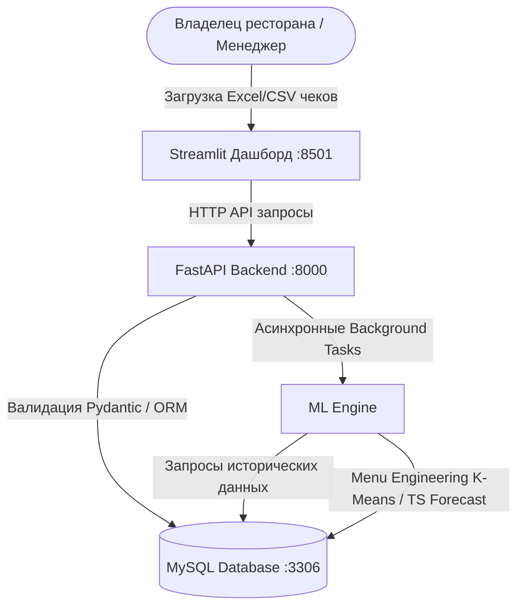

# GastroSense: End-to-End SaaS ресторанной аналитики и предсказания спроса

**GastroSense** — это готовая к продакшену аналитическая SaaS-платформа уровня Middle ML Engineer / Data Scientist, разработанная специально для предприятий общественного питания (кафе, бургерные, рестораны). 

Сервис позволяет ресторанному менеджменту загружать сырые выгрузки чеков из популярных CRM-систем (iiko, R-Keeper, МойСклад), сохранять их в структурированном виде, автоматически обучать ML-модели и получать бизнес-инсайты на интерактивном дашборде.

---

## 🏗️ Архитектура платформы



1. **Frontend**: Streamlit-приложение с премиальным темным интерфейсом и интерактивными графиками Plotly.js.
2. **Backend**: Высокопроизводительный асинхронный FastAPI веб-сервер. Валидирует загруженные файлы чеков с помощью Pydantic и нормализует их в реляционную БД.
3. **Database**: СУБД MySQL. Хранит заказы (`orders`), товарные позиции (`order_items`), результаты сегментации меню (`menu_analysis`) и прогнозы спроса (`demand_forecast`).
4. **ML Engine**: Фоновый модуль машинного обучения:
   - **K-Means Clustering**: Кластеризация всего меню ресторана на 4 квадранта матрицы Menu Engineering (Звезды, Лошадки, Загадки, Собаки) на основе популярности и маржинальности.
   - **Time Series Forecaster**: Автоматически выбирает лучшую модель (Ridge, Random Forest, XGBoost или LightGBM) по результатам валидации на исторических данных и строит рекурсивный прогноз выручки и объема заказов на 7 дней вперед.

5. **AI Copilot (RAG + Gemini)**: Чат-ассистент справа собирает контекст из БД, результатов ML, отчётов и документации проекта, после чего отвечает через Gemini с опорой на найденные источники.

---

## 🦾 Используемые технологии и алгоритмы

### 1. Menu Engineering (K-Means Clustering)
Алгоритм группирует позиции меню на основе двух бизнес-метрик:
- **Популярность (Popularity)**: Суммарное количество проданных блюд.
- **Прибыльность (Profit Margin)**: Средняя маржа на блюдо (моделируется на основе реальных ресторанных бенчмарков Food Cost).

После масштабирования признаков (`StandardScaler`) обучается **K-Means** (4 кластера). Центроиды кластеров автоматически сопоставляются с бизнес-сегментами матрицы Смита-Шона:
- 🌟 **Звезды (Stars)**: Высокие продажи, высокая маржа.
- 🐎 **Рабочие лошадки (Workhorses)**: Высокие продажи, низкая маржа.
- ❓ **Загадки (Puzzles)**: Низкие продажи, высокая маржа.
- 🐕 **Собаки (Dogs)**: Низкие продажи, низкая маржа.

### 2. Временные ряды и прогнозирование спроса (LightGBM)
Для прогнозирования выручки и спроса строятся следующие признаки:
- **Календарные фичи**: День недели, день месяца, месяц, флаг выходного дня (пятница-воскресенье).
- **Лаги (Lags)**: Значения целевой переменной за 1, 2 и 7 дней назад.
- **Скользящие средние (Rolling Averages)**: Среднее за 3 и 7 дней для фильтрации шумов.

Модель обучается на исторических данных. Перед прогнозом кандидаты (Ridge, Random Forest, XGBoost, LightGBM) проверяются на отложенной выборке (walk-forward validation), и выбирается модель с наименьшей ошибкой (RMSE). Предсказание на 7 дней вперед строится рекурсивно: значение, спрогнозированное на день T, подается как лаг для дня T+1.

### 3. Анализ совместных покупок (Market Basket Analysis)
Определяется условная вероятность совместной покупки позиций в одном чеке: доля чеков с позицией B среди чеков, где уже есть позиция A. Результат выводится в виде интерактивной тепловой карты сопряженности блюд.

---

## ⚡ Быстрый старт за 1 клик

Проект полностью контейнеризирован и запускается одной командой.

### Предварительные требования
У вас должен быть установлен [Docker](https://www.docker.com/) и [Docker Compose](https://docs.docker.com/compose/).

### Запуск платформы

1. Клонируйте репозиторий (или перейдите в папку проекта):
   ```bash
   cd project_portfolio
   ```

2. Запустите Docker контейнеры:
   ```bash
   docker-compose up --build
   ```

3. После успешного запуска перейдите по адресам:
   - **Интерактивный дашборд**: [http://localhost:8501](http://localhost:8501)
   - **Документация API (Swagger)**: [http://localhost:8000/docs](http://localhost:8000/docs)

---

## 🚀 Как протестировать демо-режим?

1. Откройте дашборд в браузере: [http://localhost:8501](http://localhost:8501).
2. На боковой панели слева нажмите кнопку **«🚀 Запустить демо-режим (1 клик)»**.
3. Бэкенд автоматически очистит базу данных, сгенерирует **180 дней реалистичной истории продаж** для вымышленного заведения **"True Burgers"** (с учетом недельной сезонности, трендов, праздников и зависимостей в чеках) и запустит обучение ML-моделей.
4. Страница обновится, и вы увидите полноценный рабочий дашборд с прогнозами спроса, картой ассоциаций и рекомендациями.
