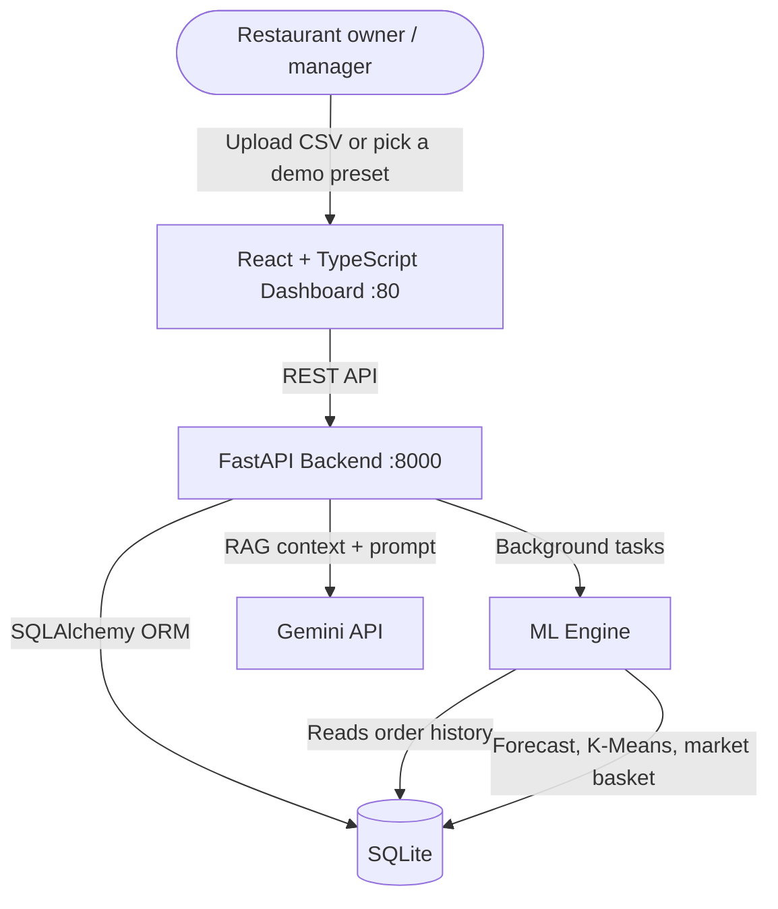

# GastroSense


**[Russian version / Русская версия](README.ru.md)**

A restaurant analytics dashboard I built to practice end-to-end ML engineering: not just training models, but shipping them behind a real API, a real frontend, and a chat assistant that can explain the results in plain language.

It takes raw order data (CSV exports from POS systems like iiko or R-Keeper, or generated demo data) and turns it into three things a restaurant owner actually cares about: a demand forecast, a menu profitability breakdown, and a combo/cross-sell analysis grounded in real order history instead of guesswork.

## Preview

| Sales forecast | Menu engineering | Cross-sales combos |
|---|---|---|
|  |  |  |

## What it does

**Sales forecasting.** Trains four candidate models (Ridge, Random Forest, XGBoost, LightGBM) on calendar features, lags, and rolling averages, validates them on held-out data with walk-forward validation, and picks whichever one actually performed best instead of hardcoding a single algorithm. The chosen model then produces a recursive 7-day forecast. The dashboard lets you scroll back through 7 days to a full year of history alongside it.

**Menu engineering.** Clusters every menu item into the classic BCG-style segments (Stars, Workhorses, Puzzles, Dogs) using K-Means on popularity and margin, after standardizing both features so neither dominates the clustering just because of scale.

**Cross-sales / combo analysis.** This is the part I iterated on the most. A naive "what's bought together most often" ranking gets fooled by rare items — if something is only ordered twice and both times paired with coffee, that's not a real pattern, it's noise. So instead of raw co-occurrence, the dashboard computes **lift**: how many times more often two items are actually bought together compared to what random chance alone would predict. Lift above 1x means real synergy worth promoting as a bundle; lift below 1x means the items get ordered together *less* than chance would predict, even if they technically co-occur sometimes. Pairs with too few orders behind them are filtered out entirely so small samples can't fake a signal.

**AI copilot.** A chat panel backed by a small RAG pipeline (TF-IDF over per-domain summaries of the live database, plus the project docs) and Gemini. It can answer "why isn't X a good combo with Y" using the actual lift numbers above, not a guess from item names. If a question can't be answered from the indexed data, it says so instead of making something up. Gemini calls go through a multi-model fallback chain so a single model hitting its free-tier quota doesn't take the whole assistant down.

## Two ways to look at this project

1. **Full stack, locally (recommended)** — the React dashboard + FastAPI backend + SQLite + the AI chat assistant, all in Docker Compose. This is the real thing, with live model training and the RAG-grounded chat.
2. **`dashboard/`** — a standalone single-file Streamlit version with baked-in demo presets and PDF export, meant to be deployed somewhere free (Render) as a zero-setup link to look at without cloning anything. It doesn't talk to the FastAPI backend; it's a separate, lighter artifact for quick browsing.

The rest of this README is about option 1.

## Architecture



| Layer | Stack |
|---|---|
| Frontend | React, TypeScript, Vite, TailwindCSS, Recharts, TanStack Query |
| Backend | FastAPI, Pydantic, SQLAlchemy |
| Database | SQLite |
| ML Engine | scikit-learn, XGBoost, LightGBM, pandas |
| AI Copilot | TF-IDF + cosine similarity RAG (no vector DB), Gemini API |

The ML Engine runs as background tasks after every upload/seed — forecasting, menu clustering, and market basket analysis, described above. The AI Copilot indexes rolled-up summaries of the current database plus this README, then hands the retrieved context to Gemini.

## Running it

Requirements: [Docker](https://www.docker.com/) and Docker Compose.

```bash
docker-compose up --build
```

Then open:
- Dashboard: [http://localhost](http://localhost)
- API docs (Swagger): [http://localhost:8000/docs](http://localhost:8000/docs)

There's no real restaurant's data sitting in this repo, obviously — the dashboard auto-loads a demo preset (Casual Coffee Shop, by default) on first run, or pick a different one from the sidebar dropdown, or upload your own CSV export. Seeding a preset generates a year of synthetic-but-realistic order history (weekly seasonality, trends, holidays, and item co-purchase patterns included) and kicks off model training in the background.

## Tests

```bash
cd backend
pytest
```

Covers the forecaster's model selection, the menu clustering, and the chat agent's RAG grounding and fallback behavior.
